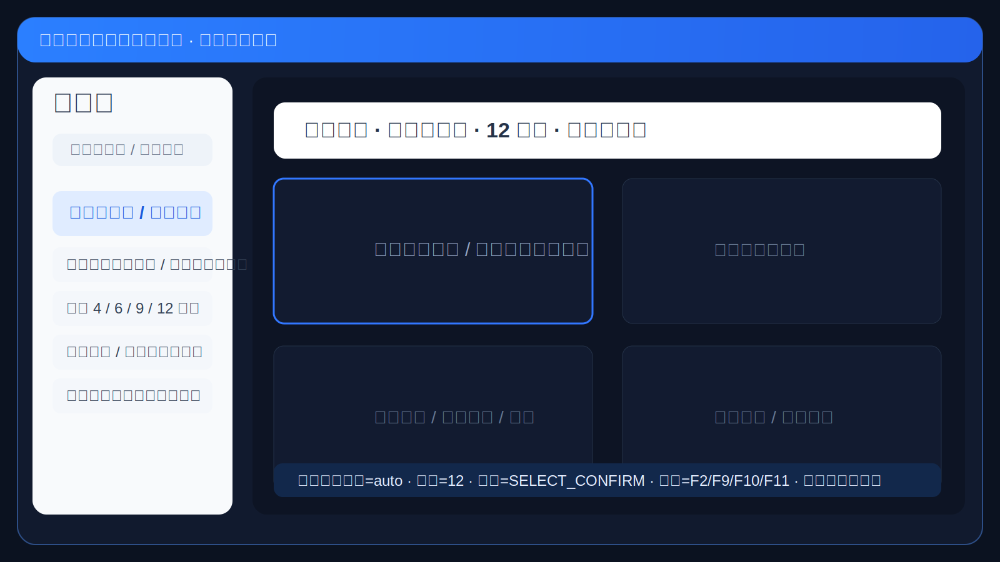
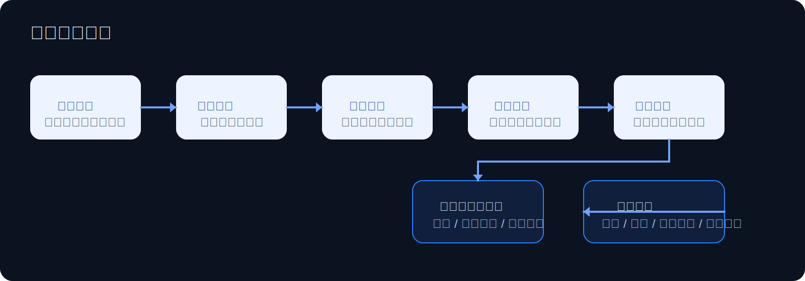
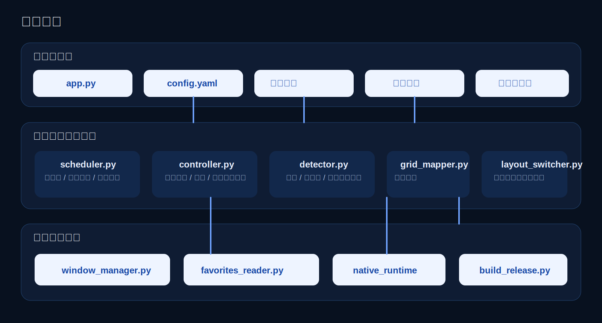

# 视频平台客户端轮询助手

面向 `视频融合赋能平台 / 视频监控客户端` 的自动化轮询辅助工具。  
项目来自真实政企驻场运维场景，目标是把“人工值班反复点选监控画面”的重复流程做成可配置、可恢复、可跨电脑部署的 Windows 自动化工具。

## 项目定位

这个项目解决的是一个很实际的问题：

- 值班或巡检时，需要持续轮询多个监控画面
- 人工操作重复、容易漏看、效率低
- 客户端还存在全屏/非全屏、不同宫格、异常黑屏、前台漂移等不稳定因素

我把这件事做成了一个独立工具，让轮询流程从“人肉点击”变成“可控自动化”。

## 首页图示

### 项目界面示意



### 轮询执行流程



### 系统架构图



## 核心能力

- 支持完整轮询动作链路  
  `单击选中 -> 双击放大 -> 停留 -> 双击返回宫格 -> 下一路`
- 支持 `4 / 6 / 9 / 12` 宫格
- 支持 `全屏 / 非全屏` 两种运行模式
- 支持多种轮询顺序  
  `row_major / column_major / custom / favorites_name`
- 支持人工监管与热键接管  
  `暂停 / 步进 / 紧急恢复 / 安全退出`
- 支持异常检测与自动恢复  
  `黑屏 / 预览失败 / 前台漂移 / 动作中断`
- 支持跨电脑部署和固定宫格发布版本

## 项目亮点

### 1. 用状态机把轮询动作做稳定

不是简单的“定时双击”。  
项目把轮询过程拆成明确阶段，保证动作可追踪、可恢复、可插入人工接管。

### 2. 面向真实客户端场景做兼容

现场环境不是理想状态，所以做了：

- 全屏/非全屏自动识别
- 多宫格识别与映射
- 收藏夹顺序读取
- 失败场景下的安全跳过与恢复

### 3. 支持值班场景下的人机协作

这个工具不是“无人值守脚本”，而是“自动化 + 人工监管”模式。

- `F2` 启停 / 继续
- `F9` 暂停态步进下一路
- `F10` 安全停止
- `F11` 紧急恢复当前路

这让它更适合真实值班环境，而不是只适合实验环境。

## 技术栈

- Python
- Windows 自动化
- 状态机调度
- 图像/界面状态检测
- 配置驱动
- 跨机器发布脚本

## 核心流程

```text
单击选中
-> 等待稳定
-> 双击放大
-> 放大停留
-> 双击返回宫格
-> 返回后停留
-> 下一路
```

## 仓库结构

- `app.py`：程序入口
- `scheduler.py`：状态机与热键调度核心
- `detector.py`：黑屏/异常/返回状态检测
- `grid_mapper.py`：宫格切分与顺序映射
- `controller.py`：鼠标、双击、恢复等输入执行
- `window_manager.py`：窗口发现与模式识别
- `favorites_reader.py`：收藏夹顺序读取
- `config.example.yaml`：配置示例
- `fixed_layout_programs/`：固定宫格发布入口

## 快速开始

### 1. 安装依赖

```powershell
.\install_deps.bat
```

### 2. 标定窗口区域

```powershell
python app.py --calibrate windowed
python app.py --calibrate fullscreen
```

### 3. 检查标定结果

```powershell
python app.py --inspect-calibration windowed
python app.py --inspect-calibration fullscreen
```

### 4. 自测

```powershell
python self_test.py
```

### 5. 启动

```powershell
python app.py --run --mode auto
```

## 适合面试讲解的点

- 这是一个来自真实政企驻场场景的工具型项目，不是教程 demo
- 核心难点不是“写脚本”，而是把不稳定客户端场景做成可运行的状态机系统
- 我把运维现场问题转成了可交付工具，体现的是工程落地能力

## 公开仓库说明

这是用于展示项目能力的公开仓库版本，已移除：

- 运行日志
- 发布产物
- 现场截图
- 本地运行时目录
- 本地配置文件

## 相关文档

- [HOW_TO_USE.md](HOW_TO_USE.md)
- [DEVELOPMENT_DELIVERY_MANUAL.md](DEVELOPMENT_DELIVERY_MANUAL.md)
- [FIXED_LAYOUT_PROGRAMS.md](FIXED_LAYOUT_PROGRAMS.md)
- [fixed_layout_programs/README.md](fixed_layout_programs/README.md)
- [config.example.yaml](config.example.yaml)
